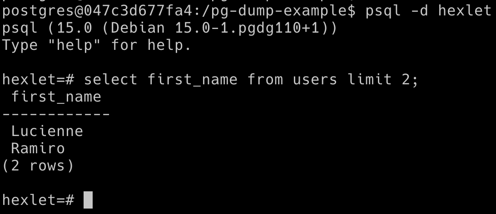

# Установка PostgreSQL

## Подготовка Windows

Для работы с PostgreSQL в Windows вам нужно [включить подсистему Ubuntu](https://guides.hexlet.io/ru/ubuntu-linux-in-windows/).

## Установка

Установка PostgreSQL выполняется через терминал. Ниже даны команды для MacOS, Windows и Ubuntu:

```bash
# Macos
brew install postgresql

# Ubuntu, Windows
sudo apt install postgresql
```

Сразу после установки PostgreSQL автоматически запускается от имени вновь созданного пользователя _postgres_ в большинстве операционных систем. Этот пользователь понадобится нам дальше. Также будет создана база данных с именем _postgres_.

Теперь убедимся в том, что установка прошла правильно. Посмотрите из командной строки, запущен ли PostgreSQL:

```bash
ps aux | grep postgres

# Вывод может быть другим
# Главное, чтобы в нем встречалась строчка с текстом bin/postgres
postgres  3437  0.0  2.3 295008 24160 ?        S    12:01   0:00 /usr/lib/postgresql/9.5/bin/postgres -D /var/lib/postgresql/9.5/main -c config_file=/etc/postgresql/9.5/main/postgresql.conf
```

В вашем случае вывод может отличаться, но главное — увидеть ту строчку, в которой отображается запуск самой базы данных. Если база данных запущена, то дальше нужно попробовать к ней подключиться. PostgreSQL поставляется со специальной программой *psql*, которая представляет собой интерактивную оболочку (REPL). Через него можно управлять PostgreSQL и выполнять запросы к базам данных прямо из терминала:



## Подключение PostgreSQL

Подключение всегда выполняется от имени конкретного пользователя и к конкретной базе данных. Если не указано другого, то *psql* попробует подключиться от имени пользователя, запускающего _psql_, к базе данных с тем же именем.

В самой базе данных при этом используется понятие «роль», а не «пользователь»:

```bash
psql

psql: FATAL:  role "vagrant" does not exist
```

Если PostgreSQL еще не настраивался, то такой запуск выдаст ошибку, явно указывающую на отсутствие соответствующей роли. Единственная роль, которая есть в PostgreSQL сразу после установки — *postgres*.

Если вы работаете на MacOS, то подключение уже настроено для вашего текущего пользователя (при установке будет создана одноименная роль). Но подключение с помощью команды `psql` также не сработает:

```bash
# В MacOS вывод будет другим, так как не существует базы данных с именем,
# которое совпадает с именем пользователя
psql
psql: FATAL:  database "vagrant" does not exist
```

Чтобы глубже понять тему подключения, поговорим об аутентификации. В PostgreSQL существует множество разных способов подключения. Один из самых простых методов называется **Peer Authentication**.

Он основан на совпадении двух имен:

* Имени пользователя, который подключается к PostgreSQL
* Имени роли внутри PostgreSQL

У нас есть пользователь _postgres_ снаружи и роль _postgres_ внутри базы данных, то этот метод нам подходит:

```bash
# -u - флаг для явного указания имя пользователя
sudo -u postgres psql

postgres=#
```

При таком запуске программы произойдет подключение к базе данных _postgres_ с ролью _postgres_.

Если у вас MacOS, достаточно при запуске команды `psql` указать имя базы данных, к которой выполняются подключение:

```bash
# Запуск программы от имени текущего пользователя к базе данных postgres
psql postgres

postgres=#
```

Если ваш вывод совпадает с примером, то поздравляем — подключение к PostgreSQL прошло успешно! Но войти внутрь — это еще не все. Еще нужно суметь выйти.

## Управляющие команды

Внутри `psql` доступны разные **управляющие команды**. Все они построены по одному принципу — перед командой набирается обратный слеш `\`, например:

* Чтобы выйти, надо набрать `\q`
* Чтобы посмотреть полный список команд, надо набрать `\?`

Команда `\?` загружает пейджер, по которому можно перемещаться, используя стандартные комбинации текстового редактора Vim:

    postgres=# \?
    Informational
      (options: S = show system objects, + = additional detail)
      \d[S+]                 list tables, views, and sequences
      \d[S+]  NAME           describe table, view, sequence, or index
      \da[S]  [PATTERN]      list aggregates
      \dA[+]  [PATTERN]      list access methods
      \db[+]  [PATTERN]      list tablespaces
      \dc[S+] [PATTERN]      list conversions
      \dC[+]  [PATTERN]      list casts
      \dd[S]  [PATTERN]      show object descriptions not displayed elsewhere
      \dD[S+] [PATTERN]      list domains
      \ddp    [PATTERN]      list default privileges
      \dE[S+] [PATTERN]      list foreign tables
      \det[+] [PATTERN]      list foreign tables
      \des[+] [PATTERN]      list foreign servers
      \deu[+] [PATTERN]      list user mappings
      \dew[+] [PATTERN]      list foreign-data wrappers
      ...

## Возможные проблемы

В работе с PostgreSQL вы можете столкнуться с такой проблемой:

```bash
psql

psql: could not connect to database template1: could not connect to server: No such file or directory
	Is the server running locally and accepting
	connections on Unix domain socket "/tmp/.s.PGSQL.5432"?
```

Этот вывод говорит, что подключение не удалось — нужно выяснять почему. В некоторых случаях такая ошибка возникает, если не запущен сервис _postgresql_. Тогда запустите его командой `service postgresql start` и выполните подключение повторно.

Еще вам может встретиться ошибка _psql: command not found_. Она указывает, что вы ввели не существующую команду. Это может пройти по трем причинам:

* В названии команды допущена опечатка
* PostgreSQL установлен неверно
* PostgreSQL не установлен вообще

К сожалению, возможных проблем очень много, особенно с учетом разных операционных систем и их версий. Даже опытный разработчик не всегда может взглянуть на вывод ошибки и сразу выдать решение — ему требуется время на изучение проблемы, эксперименты и поиск ответов в Google.

По этой причине мы не даем исчерпывающее руководство по ошибкам. Если у вас возникнут сложности, вопросы по установке лучше задавать [в нашем Slack-сообществе](https://slack-ru.hexlet.io) в каналах _#databases_ или _#os_.
